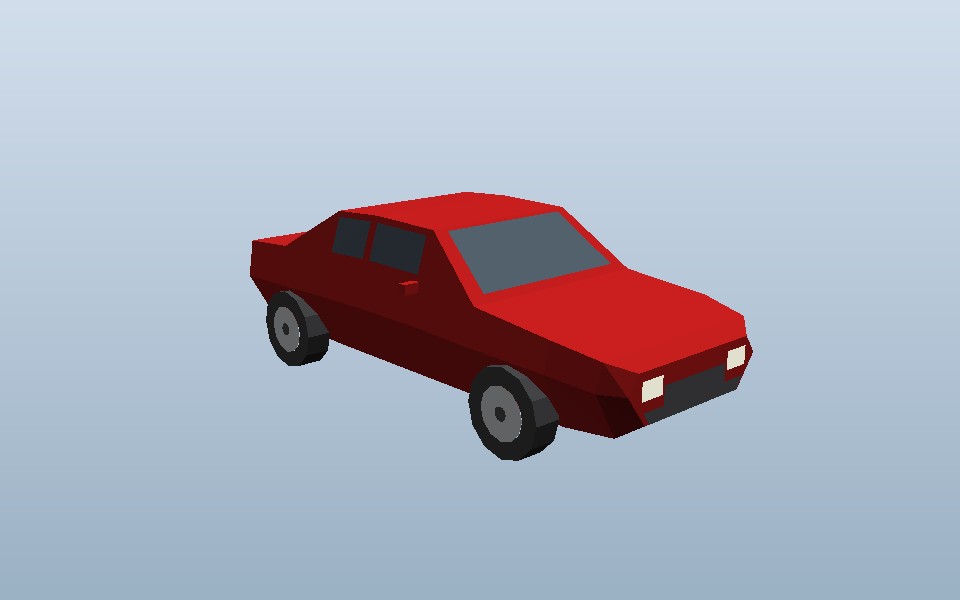

# Low-poly sedan

A game-ready low-poly sedan in glTF 2.0 binary format, generated procedurally
by a single dependency-free Python script.



| | |
|---|---|
| Model | `models/sedan_lowpoly.glb` (20.5 KB) |
| Triangles | 506 drawn (254 unique — the wheel mesh is instanced four times) |
| Materials | 8, PBR metallic-roughness, no textures |
| Shading | flat / faceted (every triangle carries its own normal) |
| Dimensions | 4.52 m long, 1.84 m wide (1.94 m over the mirrors), 1.45 m tall |
| Wheelbase | 2.70 m, 0.68 m wheels |
| Origin | centre of the car at ground level — the tyres touch y = 0 exactly |

## Conventions

Standard glTF: right-handed, **+Y up**, metres, and the car **faces −Z**.
That matches Blender's default glTF export (`+Y up, −Z forward`), Three.js and
Godot. In Unity the importer converts to its left-handed +Y-up space for you and
the car ends up facing +Z, which is Unity's forward — so it just works.

## Scene graph

```
Sedan
├── Body       paint · glass · headlight · taillight · trim · underbody
├── Wheel_FL   translation (+0.84, 0.34, −1.35)
├── Wheel_FR   translation (−0.84, 0.34, −1.35)
├── Wheel_RL   translation (+0.84, 0.34, +1.35)
└── Wheel_RR   translation (−0.84, 0.34, +1.35)
```

Each wheel is its own node with its origin **at the hub centre** and its axle on
X, so you can drive them straight from code with no re-pivoting:

* roll — rotate the wheel node about its local **X** axis
* steer — rotate the two front nodes about their local **Y** axis

The four wheels share one mesh, and that mesh is symmetric about its axle, so
there is no mirrored/negative-scale node anywhere in the file.

## Materials

`paint`, `glass`, `headlight`, `taillight`, `rim`, `tire`, `trim`, `underbody`.
All untextured `pbrMetallicRoughness` — retint any of them in your engine
without touching the mesh. The head/taillights carry an `emissiveFactor` so they
read as lit under a bloom pass.

The glass is **opaque** dark blue-grey. That is the usual choice for this art
style: no alpha sorting, no per-frame depth-sort cost, and no interior to model.
To make it see-through instead, set the `glass` material's alpha below 1 and its
alpha mode to `BLEND` in your engine (or in `materials()` in the generator, plus
an `"alphaMode": "BLEND"` key on the emitted material).

There are no UVs. Nothing in the model is textured, and adding a UV set that no
material samples would only cost file size. If you later want decals or a livery
atlas, unwrap in Blender after import.

## Regenerating

Python 3.6+, standard library only. No numpy, no trimesh, no Blender.

```sh
python3 tools/make_sedan.py                          # -> models/sedan_lowpoly.glb
python3 tools/make_sedan.py --color 1B5E9E           # a blue one
python3 tools/make_sedan.py --wheel-segments 8 \
        -o models/sedan_chunky.glb                   # cheaper, chunkier wheels
```

`--color` takes sRGB hex the way you would type it into a colour picker; the
script converts to the linear values glTF wants.

### Reshaping it

The whole body is one loft through the `SECTIONS` table near the top of
`tools/make_sedan.py`. Each row is one cross-section — a hexagon given as
`(z, y_floor, y_shoulder, y_roof, w_floor, w_shoulder, w_roof)`, mirrored across
X. Editing a row reshapes the car; adding a row adds a crease. Raise the roof
heights of rows 4–6 for a taller cabin, stretch their `z` for a limousine, drop
the shoulder widths for something narrower.

The windows are not modelled separately: they are inset sub-panels of the loft's
own quads, lifted 12 mm off the surface. That is why every window has a body
coloured frame and why the A/B/C pillars appear without any extra geometry — the
inset margins in `build_body()` control how thick those pillars look.

## Previewing without a 3D app

`tools/preview_glb.py` is a small software rasteriser — it parses the GLB and
writes a flat-shaded, z-buffered PNG using nothing but the standard library.

```sh
python3 tools/preview_glb.py models/sedan_lowpoly.glb -v hero -o preview.png
python3 tools/preview_glb.py models/sedan_lowpoly.glb -v side -w 1280 -t 800 -o side.png
```

Views: `hero`, `side`, `front`, `rear`, `top`. It understands only the subset of
glTF this repo emits — it is a sanity check on the generator, not a viewer.
