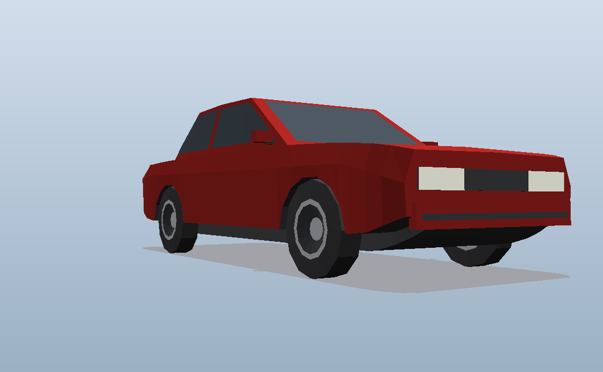

# Low-poly sedan

A game-ready low-poly sedan in glTF 2.0 binary format, generated procedurally
by a single dependency-free Python script.




| | |
|---|---|
| Model | `models/sedan_lowpoly.glb` (61 KB) |
| Triangles | 1376 drawn — 944 unique, the wheel mesh is instanced four times |
| Materials | 9, PBR metallic-roughness, no textures |
| Shading | flat / faceted (every triangle carries its own normal) |
| Dimensions | 4.65 m over the bumpers, 1.80 m wide (1.94 m over the mirrors), 1.475 m tall |
| Wheelbase | 2.70 m, 1.55 m track, 0.71 m wheels |
| Origin | centre of the car at ground level — the tyres touch y = 0 exactly |

## Conventions

Standard glTF: right-handed, **+Y up**, metres, and the car **faces −Z**.
That matches Blender's default glTF export (`+Y up, −Z forward`), Three.js and
Godot. In Unity the importer converts to its left-handed +Y-up space for you and
the car ends up facing +Z, which is Unity's forward — so it just works.

## Scene graph

```
Sedan
├── Body       paint · glass · headlight · taillight · trim · plate · underbody
├── Wheel_FL   translation (+0.775, 0.355, −1.38)
├── Wheel_FR   translation (−0.775, 0.355, −1.38)
├── Wheel_RL   translation (+0.775, 0.355, +1.32)
└── Wheel_RR   translation (−0.775, 0.355, +1.32)
```

Each wheel is its own node with its origin **at the hub centre** and its axle on
X, so you can drive them straight from code with no re-pivoting:

* roll — rotate the wheel node about its local **X** axis
* steer — rotate the two front nodes about their local **Y** axis

The four wheels share one mesh, and that mesh is symmetric about its axle, so
there is no mirrored/negative-scale node anywhere in the file.

## How the shape is built

Not one lofted blob. Three volumes, because that is what gives a car hard
character lines instead of melted ones:

**Lower body** — a loft along Z whose cross-section is an 11-point ring. Each
ring point rides its own *rail*, a piecewise-linear function of Z, so the floor
pan, sill, arch lip, shoulder crease, beltline and deck crown are each a
continuous edge running the length of the car. The creases are structural, not
decorative. `ARCH_W` sits slightly inboard of `SIDE_W`, so the flank leans out
on the way up and tucks in above the crease — that change of direction is what
makes the crease catch light.

**Wheel arches** are real openings. Ring points 1 and 2 (and their mirrors) ride
a height `h(z)` that bulges up over each axle along a circular arc, cutting the
side panel away; the gap is closed by a wheel-well ceiling and an inner fender
wall. Between the arches `h(z)` collapses back to the sill line, which keeps the
loft's topology constant everywhere and avoids any special-casing.

**Greenhouse** — a separate 4-point loft sitting on the deck, buried a few cm
into it so the windscreen and backlight emerge from the body instead of meeting
it in a coincident seam.

Windows are inset sub-panels lifted 10 mm off the surface, so the pillars and
window frames are the *gaps left over* rather than extra geometry. The door
glass walks across section boundaries rather than insetting a single loft quad
— insetting one quad chops the window off at the roof corners and leaves an
A-pillar half a metre thick.

Bumpers are body-coloured volumes standing 40 mm proud with a dark rubbing
strip, and the lamps are shallow boxes rather than flat decals, so both catch
their own highlight and read at a silhouette.

## Regenerating

Python 3.6+, standard library only. No numpy, no trimesh, no Blender.

```sh
python3 tools/make_sedan.py                          # -> models/sedan_lowpoly.glb
python3 tools/make_sedan.py --color 1B5E9E           # a blue one
python3 tools/make_sedan.py --wheel-segments 8 \
        --arch-segments 5 -o models/sedan_chunky.glb # cheaper, chunkier
```

`--color` takes sRGB hex the way you would type it into a colour picker; the
script converts to the linear values glTF wants.

### Reshaping it

Edit the rails. `BELT_Y` is the hood and deck line, `CREASE_Y` the shoulder,
`SIDE_W` the widest half-width, and so on — each is a short list of
`(z, value)` pairs. Raise the `CABIN` roof heights for more headroom, stretch
their `z` for a limousine, drop `SIDE_W` for something narrower. `ARCH_R`
and `AXLES` size and place the wheel openings.

Two constraints the loft relies on: `FLOOR_Y < SILL_Y` everywhere, or the ring
turns inside out; and `CREASE_Y` must clear the top of the arch arc
(`ARCH_CY + ARCH_R`), or the opening breaks through the shoulder.

## Materials

`paint`, `glass`, `headlight`, `taillight`, `rim`, `tire`, `trim`, `plate`,
`underbody`. All untextured `pbrMetallicRoughness` — retint any of them in your
engine without touching the mesh. The head/taillights carry an `emissiveFactor`
so they read as lit under a bloom pass.

The glass is **opaque** dark blue-grey. That is the usual choice for this art
style: no alpha sorting, no per-frame depth-sort cost, and no interior to model.
To make it see-through instead, set the `glass` material's alpha below 1 and its
alpha mode to `BLEND` in your engine (or in `materials()` in the generator, plus
an `"alphaMode": "BLEND"` key on the emitted material).

There are no UVs. Nothing in the model is textured, and adding a UV set that no
material samples would only cost file size. If you later want decals or a livery
atlas, unwrap in Blender after import.

## Previewing without a 3D app

`tools/preview_glb.py` is a small software rasteriser — it parses the GLB and
writes a flat-shaded, z-buffered PNG using nothing but the standard library. It
draws a ground plane and a contact shadow, because a car floating in a void is
impossible to judge for stance or ride height.

```sh
python3 tools/preview_glb.py models/sedan_lowpoly.glb -v hero -o preview.png
python3 tools/preview_glb.py models/sedan_lowpoly.glb -v side -w 1280 -t 560
```

Views: `hero`, `side`, `front`, `rear`, `top`, `low`. `--no-ground` drops the
floor. It understands only the subset of glTF this repo emits — it is a sanity
check on the generator, not a viewer.
